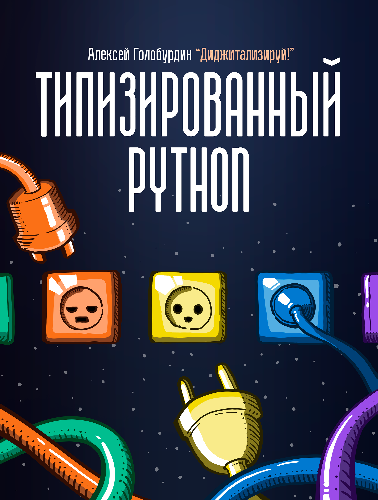

# Типизированный Python для профессиональной разработки

*Алексей Голобурдин,
команда Диджитализируй!*

*обложка —  [Васильев Никита](https://vk.com/vasiliev.narisoval), nikita.vasiliev@math.msu.ru*

> **PDF и EPUB версию книги** можно бесплатно скачать здесь: [t.me/t0digital/151](https://t.me/t0digital/151)

Цель этой книги — помочь тебе научиться писать более красивые, надёжные и легко сопровождаемые программы на Python. То, о чём мы здесь будем говорить, это не начальный уровень владения языком, предполагается, что ты уже минимально умеешь программировать, но хочешь научиться делать это лучше.

И это — отличная цель, к которой мы вместе будем двигаться на протяжении ближайших часов!

Этот материал есть также в видео формате на моём YouTube — [«Диджитализируй!»](https://www.youtube.com/watch?v=dKxiHlZvULQ).

    <iframe width="560" height="315" src="https://www.youtube.com/embed/dKxiHlZvULQ" title="YouTube video player" frameborder="0" allow="accelerometer; autoplay; clipboard-write; encrypted-media; gyroscope; picture-in-picture" allowfullscreen></iframe>

Также обращаю внимание, что на момент написания этих строк готовится перезапуск моего авторского курса «Основы компьютерных и веб-технологий на Python» [course01.to.digital](https://course01.to.digital/), запуск планируется в июне 2022, если ты читаешь этот материал позже, то вполне вероятно, что на курс уже снова можно записаться.

Итак!

Часто в учебниках и курсах по Python не уделяют должного внимания типизации и некоторым структурам, в то время как они очень важны и могут значительно, просто драматически улучшить твой код.

В ревью кода начинающих разработчиков часто видны результаты того, что в учебных материалах не уделяется отдельное внимание вопросам типизации. В коде не используются подсказки типов, используются неправильно, не лучшим образом выбираются типы для разных данных в приложении и так далее. Качество программы и её надёжность страдают — а это гораздо более важные параметры, чем многие поначалу думают. Поначалу кажется, что я написал программу, она в моих идеальных условиях работает и этого достаточно. Но нет, этого недостаточно.

Наличие функциональности это одно, а надёжность этой функциональности и качество реализации этой функциональности это совсем другое. Наличие функциональности это когда вы видите обувь и думаете — о, отлично, можно её надеть и пойти в ней куда-то. А надёжность и качество реализации этой функциональности это про то, что у вас не треснет подошва где-то на улице, в обувь не будет попадать вода, обувь не будет натирать вам ноги, она не потеряет быстро приличный вид, а также это про то, что обувь легка в эксплуатации, её можно легко протереть, её можно ремонтировать и многое другое.

То, что мы написали программу и она имеет функциональность — это вовсе не означает, что программа действительно хороша. В этой небольшой книге мы поговорим о том, как разрабатывать, думая не только о функциональности, но и о качестве и надёжности её реализации.

> Оглавление есть в самом PDF документе. В программе просмотра PDF можно найти раздел Оглавление и открыть его.

Мы поговорим о типизации в Python, поговорим о нескольких структурах и встроенных типах:

- `NamedTuple`,
- `dataclass`,
- `TypedDict`,
- `Enum`,
- `Literal`,
- `Union`, `Optional`,
- `Iterable`, `Sequence`, `Mapping`,
- `Callable`,
- `TypeVar`, `TypeAlias` и др.

Напишем приложение погоды, используя эти типы и поясняя по ходу некоторые архитектурные моменты выбора того или иного подхода. [Смотри видео версию этой книги на YouTube](https://www.youtube.com/channel/UC9MK8SybZcrHR3CUV4NMy2g) и читай обязательно до конца.

Обещаю, что после проработки этого материала твой код больше никогда не будет прежним. Буквально — драматическое улучшение кода гарантировано. Как пишут в англоязычных книжках, *dramatic improvement*!

 Поднимаемые вопросы актуальны, кстати, не только для Python, говорить мы будем о нём, но аналогичные подходы применимы и к PHP, TypeScript и тд. Подходы к написанию качественного ПО схожи для разных языков программирования, выступающих просто инструментом реализации задумок автора кода.

Говорить мы здесь будем о версии Python 3.10. В предыдущих версиях Python некоторые аспекты работают чуть иначе (нужно импортировать некоторые типы из `typing`, например), но это не столь критично.

> Самое время подписаться:
> [YouTube](https://www.youtube.com/channel/UC9MK8SybZcrHR3CUV4NMy2g)   |   [Telegram](https://t.me/t0digital)   |   [VK](https://vk.com/digitalize.team)

Начать нужно с разговора о самой типизации и о том, почему этому нужно уделять тщательное внимание. Итак, подсказки типов Python или, что то же самое, type hinting. 

