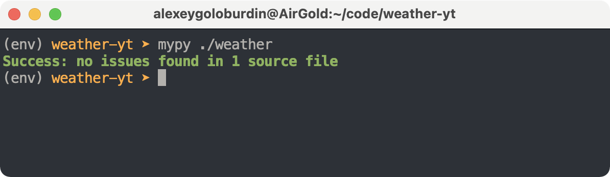
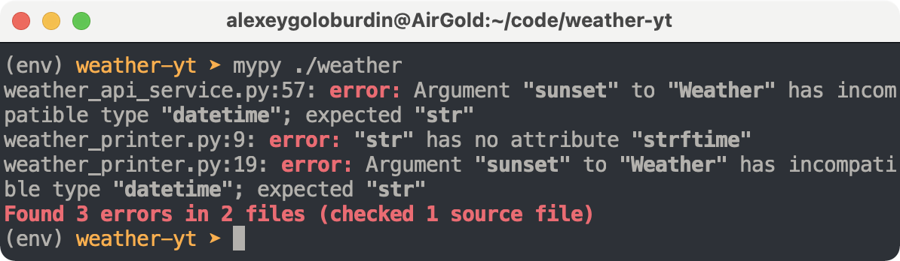

# Статические анализаторы mypy и pyright

`mypy` это инструмент, который устанавливается отдельно как pip пакет и запускается в проекте как часть тестов или CI/CD процесса. Перед сборкой и раскаткой приложения на сервер запускается проверка исходного Python кода с `mypy` и если `mypy` находит ошибки, то процесс останавливается, разработчики исправляют найденные ошибки и процесс повторяется. Это приводит к тому, что до продакшн, то есть до рантайма и до живых пользователей соответственно ошибок долетает меньше, потому что многое выявляется на более ранних этапах.

В директории проекта создадим и активируем виртуальное окружение, установим в него `mypy` и запустим проверку нашего кода:

```bash
python3.10 -m venv env
. ./env/bin/activate
pip install mypy
mypy ./weather
```



Как видим, `mypy` не нашёл проблем в нашем коде. Внесём специально ошибку в код и убедимся, что `mypy` её найдёт:



Запуск `mypy` можно встроить в процесс CI/CD, чтобы процесс разворачивания приложения на серверах не запускался, если проверки `mypy` не прошли. Таким образом до runtime не смогут дойти ошибки, связанные с некорректным использованием типов данных, и это здорово — надёжность приложения значительно возрастает!

И ещё важно отметить, что используя mypy, вы можете проверять корректность своих тайп хинтингов, которые вы указали. Пока учишься могут быть вопросы, правильно ли указан тип — вот можно указать тип у параметра функции, вызвать эту функцию с данными и посмотреть, как поведёт себя проверятор типов, встроенный в IDE, и как поведёт себя `mypy`.

Помимо `mypy` пользуется популярностью анализатор `pyright`. Они работают по-разному, например, такой код валиден с точки зрения `mypy` (и с точки зрения анализатора, встроенного в PyCharm IDE), но невалиден с точки зрения `pyright`:

```python
class User:
    def __init__(self):
        self.name: str = "Petr"

    def yo(self):
        self.name = {}
```

Анализаторы кода продолжают развиваться и дорабатываться, они неидеальны, но проставлять подсказки типов — обязательное условие для серьёзных проектов. Анализаторы кода достаточно умны уже сейчас и станут ещё умнее в будущем.


