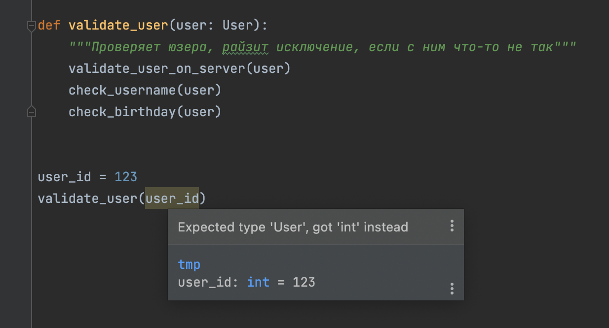

# Раннее выявление ошибок

Первое — это ранее выявление ошибок. Есть у нас некая программа и есть в этой некой программе ошибка. Когда мы можем её выявить? Мы можем выявить её на этапе написания программы, мы можем выявить её на этапе подготовки программы к разворачиванию на сервере, или мы можем выявить её на этапе runtime, то есть когда программа уже опубликована на сервере, ей пользуются пользователи.

Как вы думаете, на каком этапе лучше выявлять ошибки? Очевидно — чем раньше, тем лучше. Если ошибки долетают до пользователей, то это максимально плохо. Почему?

Во-первых, потому что пользователи недовольны, а раз пользователи недовольны, то много денег мы с нашим программным продуктом не заработаем, так как люди не будут охотно его покупать и рекомендовать другим. К тому же очень неприятно, что мы занимаемся любимым делом, активно трудимся, реализуем сложные алгоритмы, а результатом нашего труда пользователи недовольны. И винить-то объективно некого, кроме нас самих. Непорядочек, непорядочек!

Во-вторых, недовольные пользователи обращаются в техподдержку, создают тикеты, которые спускаются потом на разработку — это всё тратит деньги компании. Если ничего не ломается, то обращений в поддержку мало, тикетов мало, а разработчики заняты разработкой новых фичей продукта, а не постоянными правками отвалившейся старой логики. Постоянные поломки это постоянные финансовые потери.

В-третьих, из-за ошибок, которые видят пользователи, компания несёт репутационные потери. Пользователи пишут негативные отзывы, они легко гуглятся другими потенциальными пользователями, СМИ, инвесторами, всё это в конечном итоге негативно влияет и на капитализацию компании, и на возможности привлечения инвестиций, и на чистую прибыль компании, если она вообще есть.

Если мы хотим быть профессиональными высокооплачиваемыми специалистами, то наша задача — генерировать через результаты нашей работы радость и прибыль, а не поток проблем и убытков.

Поэтому важнейшая задача для нас — сделать так, чтобы до пользователей не доходило ни одной ошибки. Для достижения этой цели нужен системный подход, одной внимательности в процессе программирования мало. Нужна выверенная система, алгоритм действий, инструментарий, который не позволит ошибкам дойти до пользователей.

Какой это может быть инструментарий? Это могут быть автотесты. Однако первый принцип тестирования гласит, что *тестирование может показать наличие дефектов в программе, но не доказать их отсутствие*. Тесты это хорошо, но не на одних только тестах всё держится. Чем больше капканов для разных видов ошибок расставлено, тем надёжнее программа и крепче сон разработчика. А что, в конце концов, может быть важнее крепкого, здорового сна разработчика?

Помимо автотестов (и ручного тестирования людьми) можно проверять корректность использования типов специальными инструментами. Например, компилятор Rust — прооосто красавчик! Он на этапе компиляции выявляет огромное количество проблем и попросту не даёт скомпилировать программу, если видит в ней места с ошибками. Какая-то функция может вернуть успешный результат или условный `null` и вызывающая функция не обрабатывает сценарий с `null`? Вот тебе потенциальная серьёзная ошибка. Компилятор об этом скажет и вам придется сделать всё красиво, обработать все такие моменты и они не дойдут до рантайма.

Штука в том, что в случае с динамически типизированными языками вроде Python, очень сложно написать инструментарий, который бы выполнял проверки по типам, потому что в каждый конкретный момент времени непонятно какой тип в переменной. И для того, чтобы этому инструментарию помогать, вводят подсказки типов в Python, PHP или типизацию в JavaScript в виде отдельного языка TypeScript, компилирующегося в JavaScript. Это то, что помогает выявлять ошибки на этапе до runtime. Либо на этапе подготовки сборки программы, либо даже на этапе написания программы непосредственно в редакторе кода.

Инструмент видит, что вот здесь такой-то тип данных, и если он используется некорректно, то инструмент покажет ошибку и эта ошибка не уйдёт в рантайм и пользователи не словят эту ошибку, а мы как разработчик не схлопочем по макушке от руководства. Прекрасно? Прекрасно!

То есть, ещё раз, первое, для чего вводят подсказки типов — как можно более ранее выявление ошибок, в идеале в редакторе кода в вашей IDE, либо хотя бы на этапе проверки программы перед её сборкой и публикацией на сервер.

На википедии есть прекрасная страница про системы типов, [Type system](https://en.wikipedia.org/wiki/Type_system#:~:text=The%20main%20purpose%20of%20a,connected%20in%20a%20consistent%20way.):

> The main purpose of a type system is to reduce possibilities for bugs in computer programs by defining interfaces between different parts of a computer program, and then checking that the parts have been connected in a consistent way.

То есть главной целью системы типов является уменьшение вероятности ошибок в компьютерных программах путём определения интерфейсов между разными частями программы и последующей проверки, что эти части соединены друг с другом правильным образом через эти интерфейсы. Под интерфейсами тут подразумеваются собственно типы данных, например, какие-то конкретные классы, которые описывают конкретные поля и методы.

Допустим, у нас есть вот такая функция:

```python
def validate_user(user):
    """Проверяет юзера, райзит исключение, если с ним что-то не так"""
    validate_user_on_server(user)
    check_username(user)
    check_birthday(user)
```

Под `user` тут подразумевается объект юзера, например, [ORM объект](https://ru.wikipedia.org/wiki/ORM), то есть запись из базы данных, преобразованная в специальный Python объект. Человек, написавший код, это знает. В момент написания кода знает. Через месяц он об этом совершенно точно забудет, а человек, не писавший этот код, об этом знать вовсе не может. По сигнатуре функции `def validate_user(user)` нельзя понять, какой тип данных ожидается в `user`, но при этом очень легко сделать предположение об этом типе — и ошибиться.

Спустя пол года дописывается какой-то новый код и функция `validate_user` в нём внезапно начинает вызываться с аргументом `user`, который равен не ORM объекту, а числу — просто потому что совсем неочевидно, что в `user` на самом деле подразумевается не число:

```python
user_id = 123
validate_user(user_id)
```

Этот код упадёт только в рантайме. Потому что IDE или статический анализатор кода не смогут понять, что тут есть какая-то ошибка.

Как сделать так, чтобы мы узнали об ошибке до этапа рантайма? Явным образом указать тип для атрибута `user`, например, если это экземпляр датакласса `User`, то так (о датаклассах мы поговорим подробнее дальше):

```python
from dataclasses import dataclass
import datetime

@dataclass
class User:
    username: str
    created_at: datetime.datetime
    birthday: datetime.datetime | None

def validate_user(user: User):
    """Проверяет юзера, райзит исключение, если с ним что-то не так"""
    validate_user_on_server(user)
    check_username(user)
    check_birthday(user)
```

Датакласс определяет просто структуру данных с полями `username`, `created_at` и `birthday`, причём тип поля `username` — строка, тип `created_at` — `datetime`, а `birthday` хранит `None` или значение типа `datetime`.

И теперь такой код:

```python
user_id = 123
validate_user(user_id)
```

подкрасится ошибкой уже в IDE на этапе написания кода (например, в PyCharm или настроенном VS Code или `nvim`), а также код упадёт с ошибкой в статическом анализаторе кода, который запустится при сборке проекта перед его публикацией на сервер.



Получается, что наша программа стала надёжнее, так как пользователи не увидят многие ошибки, они будут выявлены и исправлены на ранних этапах. Да, при этом надо писать типы, вводить их, думать, но кому сейчас легко:). Нам платят деньги за качественный софт, а качественный софт это в первую очередь надёжный софт, то есть софт, который не падает в рантайме с непонятными пользователю ошибками вроде `AttributeError`.

>  Цена исправления ошибки в программе тем меньше, чем раньше этап, на котором эта ошибка выявлена. Главная причина введения системы типов — уменьшение вероятности возникновения ошибок в рантайме, то есть при эксплуатации приложения.
