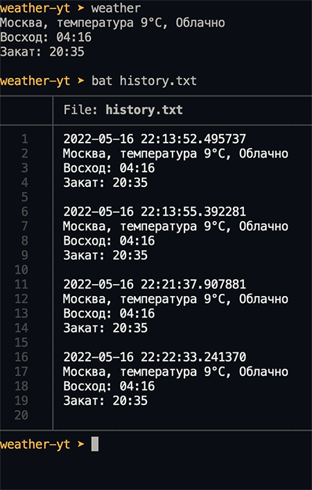
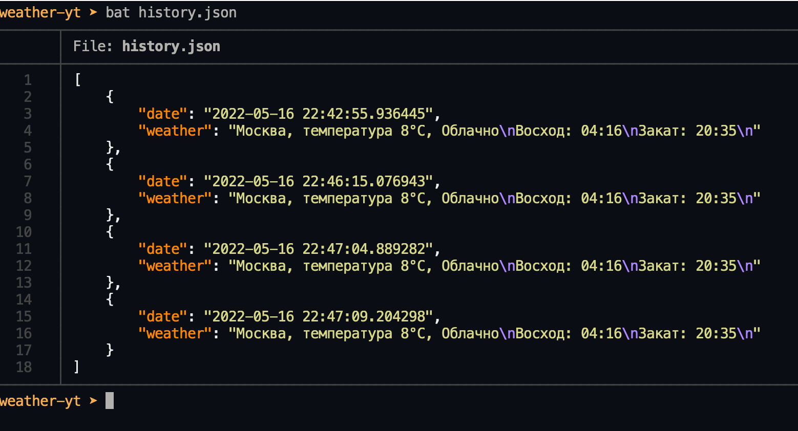

# Использование интерфейсов и протоколов

В теории объектно-ориентированного программирования есть понятия интерфейсов и абстрактных классов. Эти классы созданы для того, чтобы быть отнаследованными в других классах. Интерфейс и абстрактный класс созданы для того, чтобы показать, какими свойствами и методами должны обладать все их дочерние классы. Разница интерфейса и абстрактного класса в том, что интерфейс не содержит реализации, а абстрактный класс может помимо абстрактных методов содержать и часть реализованных методов.

Использование интерфейсов и абстрактных классов — хорошая затея, если мы хотим заложить на будущее возможность замены компонентов системы на другие. Расширяемость системы это хорошо.

Например, допустим, мы хотим реализовать сохранение истории всех запросов погоды. Чтобы при каждом запуске нашей программы куда-то сохранялись её результаты, и в будущем можно было проанализировать эту информацию.

Куда мы можем сохранить эту информацию? В плоский txt-файл. В файл JSON. В базу данных SQL. В NoSQL базу данных. Отправить куда-то по сети в какой-то веб-сервис. Вариантов много и потенциально в будущем возможно нам захочется заменить текущий выбранный вариант на какой-то другой. Давайте реализуем модуль `history.py`, который будет отвечать за сохранение истории:

```python
from weather_api_service import Weather

class WeatherStorage:
    """Interface for any storage saving weather"""
    def save(self, weather: Weather) -> None:
        raise NotImplementedError

def save_weather(weather: Weather, storage: WeatherStorage) -> None:
    """Saves weather in the storage"""
    storage.save(weather)
```

Здесь `WeatherStorage` — это интерфейс в терминах объектно-ориентированного программирования. Этот интерфейс описывает те методы, которые обязательно должны присутствовать у любого хранилища погоды. Собственно говоря, у любого хранилища погоды должен быть как минимум метод `save`, который принимает на вход погоду, которую он должен сохранить.

В интерфейсе `WeatherStorage` нет реализации (на то он и интерфейс), он только объявляет метод `save`, который должен быть определён в любом классе, реализующем этот интерфейс.

Функция `save_weather` будет вызываться более высокоуровневым управляющим кодом для сохранения погоды в хранилище. Эта функция принимает на вход погоду `weather`, которую надо сохранить, и реальный экземпляр хранилища `storage`, которое реализует интерфейс `WeatherStorage`.

Чтобы показать, что метод `save` интерфейса не реализован, мы возбуждаем в нём исключение `NotImplementedError`, эта ошибка говорит о том, что вызываемый метод не реализован. Таким образом, если мы создадим хранилище, отнаследованное от этого интерфейса, не реализуем в нём метод `save` и вызовем его, то у нас упадёт в рантайме исключение `NotImplementedError`:

```python
class PlainFileWeatherStorage(WeatherStorage):
    pass

srorage = PlainFileWeatherStorage()
storage.save()  # Тут в runtime упадёт ошибка NotImplementedError
```

Проблема такого подхода в том, что ошибка, относящаяся к проверке типов (все ли методы интерфейса реализованы в наследующем его классе) падает только в рантайме. Хотелось бы, чтобы такая проверка выполнялась в IDE и статическим анализатором кода, а не падала в рантайме. Наша задача, напомню, сделать так, чтобы до рантайма ошибки не доходили.

Какой есть ещё вариант определения интерфейсов в Python? Есть вариант с использованием встроенного модуля ABC ([документация](https://docs.python.org/3/library/abc.html)), созданного как раз для работы с такими абстрактными классами и интерфейсами:

```python
from abc import ABC, abstractmethod

class WeatherStorage(ABC):
    """Interface for any storage saving weather"""
    @abstractmethod
    def save(self, weather: Weather) -> None:
        pass
```

Экземпляр класса, наследующего таким образом объявленный интерфейс, не получится создать без явной реализации всех методов, объявленных с декоратором `@abstractmethod`. То есть вот такой код в runtime упадёт сразу в момент создания экземпляра такого класса:

```python
class PlainFileWeatherStorage(WeatherStorage):
    pass

# Тут упадет ошибка в рантайме, так как в PlainFileWeatherStorage
# не определен метод save 
storage = PlainFileWeatherStorage()  
```

Опять же — код падает в runtime, пользователи видят ошибку, плохо. Как перенести проверку на корректность использования интерфейсов и абстрактных классов на IDE и статический анализатор кода?

Способ появился в Python 3.8 благодаря [PEP 544](https://peps.python.org/pep-0544/), и он называется протоколами, `Protocol`:

```python
from typing import protocol

class WeatherStorage(Protocol):
    """Interface for any storage saving weather"""
    def save(self, weather: Weather) -> None:
        pass

class PlainFileWeatherStorage:
    def save(self, weather: Weather) -> None:
        print("реализация сохранения погоды...")

def save_weather(weather: Weather, storage: WeatherStorage) -> None:
    """Saves weather in the storage"""
    storage.save(weather)
```

Воу! Класс `PlainFileWeatherStorage` никак не связан с `WeatherStorage`, не отнаследован от него, хотя и реализует его интерфейс в неявном виде, то есть просто определяет все функции, которые должны быть реализованы в этом интерфейсе. Сам интерфейс `WeatherStorage` отнаследован от класса `typing.Protocol`, что делает его так называемым протоколом. В функции `save_weather` тип аргумента `storage` по-прежнему установлен в этот интерфейс `WeatherStorage`.

Получается, что класс `PlainFileWeatherStorage` неявно реализует протокол/интерфейс `WeatherStorage`. Если вы работали с языком программирования Go — в нём интерфейсы реализованы схожим образом, это так называемая [структурная типизация](https://en.wikipedia.org/wiki/Structural_type_system).

Почему использование такого подхода в приоритете? Потому что проверкой корректности использования интерфейсов занимается IDE и статический анализатор кода вроде `mypy`. Речь идёт уже не о проверке в runtime, речь идет о проверке корректности реализации до этапа, в котором участвуют пользователи программы. Это то, что нам нужно!

Таким образом, наш модуль `history.py` принимает следующий вид:

```python
from datetime import datetime
from pathlib import Path
from typine import Protocol

from weather_api_service import Weather
from weather_formatter import format_weather

class WeatherStorage(Protocol):
    """Interface for any storage saving weather"""
    def save(self, weather: Weather) -> None:
        raise NotImplementedError

class PlainFileWeatherStorage:
    """Store weather in plain text file"""
    def __init__(self, file: Path):
        self._file = file

    def save(self, weather: Weather) -> None:
        now = datetime.now()
        formatted_weather = format_weather(weather)
        with open(self._file, "a") as f:
            f.write(f"{now}\n{formatted_weather}\n")

def save_weather(weather: Weather, storage: WeatherStorage) -> None:
    """Saves weather in the storage"""
    storage.save(weather)
```


`PlainFileWeatherStorage` это реализованное хранилище, отнаследованное от нашего интерфейса, то есть реализующее его методы. Помимо метода `save` этот класс реализует ещё конструктор, который сохраняет в поле `self._file` путь до файла, в который будет записываться информация о погоде.

Для перевода объекта погоды типа `Weather` в строку используется функция `format_weather`, которую мы реализовали ранее в модуле `weather_formatter`. 

Этот код — абсолютно валиден с точки зрения проверки системы типов.

Вызовем теперь логику сохранения погоды в главном файле `weather`:

```python
#!/usr/bin/env python3.10
from pathlib import Path

from exceptions import ApiServiceError, CantGetCoordinates
from coordinates import get_gps_coordinates
from history import PlainFileWeatherStorage, save_weather
from weather_api_service import get_weather
from weather_formatter import format_weather


def main():
    try:
        coordinates = get_gps_coordinates()
    except CantGetCoordinates:
        print("Не смог получить GPS-координаты")
        exit(1)
    try:
        weather = get_weather(coordinates)
    except ApiServiceError:
        print("Не смог получить погоду в API-сервиса погоды")
        exit(1)
    save_weather(
        weather,
        PlainFileWeatherStorage(Path.cwd() / "history.txt")
    )
    print(format_weather(weather))


if __name__ == "__main__":
    main()
```

Здесь мы создаём экземпляр объекта `PlainFileWeatherStorage` и передаём его на вход функции `save_weather`.  Всё работает!



Для вывода содержимого текстового файла на скриншоте вместо `cat` использовался `bat` — [продвинутый вариант](https://github.com/sharkdp/bat):)

Теперь, если мы захотим изменить хранилище, мы можем создать новое хранилище, например, JSON-хранилище, реализовав в нём все методы интерфейса `WeatherStorage`, и передать это новое хранилище в `save_weather`. Всё продолжит работать и будет корректно с точки зрения типов. Причём нам не придётся ничего менять в функции `save_weather`, так как она опирается только на интерфейс, определённый в классе `WeatherStorage`.

`history.py`, добавленный код:

```python
import json
from typing import Protocol, TypedDict


class HistoryRecord(TypedDict):
    date: str
    weather: str

class JSONFileWeatherStorage:
    """Store weather in JSON file"""
    def __init__(self, jsonfile: Path):
        self._jsonfile = jsonfile
        self._init_storage()

    def save(self, weather: Weather) -> None:
        history = self._read_history()
        history.append({
            "date": str(datetime.now()),
            "weather": format_weather(weather)
        })
        self._write(history)
    
    def _init_storage(self) -> None:
        if not self._jsonfile.exists():
            self._jsonfile.write_text("[]")

    def _read_history(self) -> list[HistoryRecord]:
        with open(self._jsonfile, "r") as f:
            return json.load(f)

    def _write(self, history: list[HistoryRecord]) -> None:
        with open(self._jsonfile, "w") as f:
            json.dump(history, f, ensure_ascii=False, indent=4)
```

Здесь мы воспользовались структурой `TypedDict`, типизированным словарём. Это удобно для нашего сценария, так как каждая запись погоды в JSON-файл будет представлять собой как раз структуру словаря, состоящую из двух полей — date для `даты` и времени получения погоды и `weather` для описания погоды. Метод `_read_history` предназначен для чтения данных погоды из JSON-файла и он возвращает не `list[dict]`, а `list[HistoryRecord]`, максимально конкретный тип данных. Аналогично метод `_write` принимает в качестве аргумента не `list[dict]`, а тоже `list[HistoryRecord]`. Везде используем максимально точную конкретную структуру данных.

`weather`, изменённый код:

```python
from history import JSONFileWeatherStorage, save_weather


def main():
    # пропущено....
    save_weather(
        weather,
        JSONFileWeatherStorage(Path.cwd() / "history.json")
    )
    print(format_weather(weather))


if __name__ == "__main__":
    main()
```

Всё работает:



В процессе сохранения файла тоже может возникнуть ошибка. Например, директория может быть закрыта для записей и тд. Такие ошибки тоже нужно обработать. Напишите эту обработку самостоятельно в качестве тренировки!

