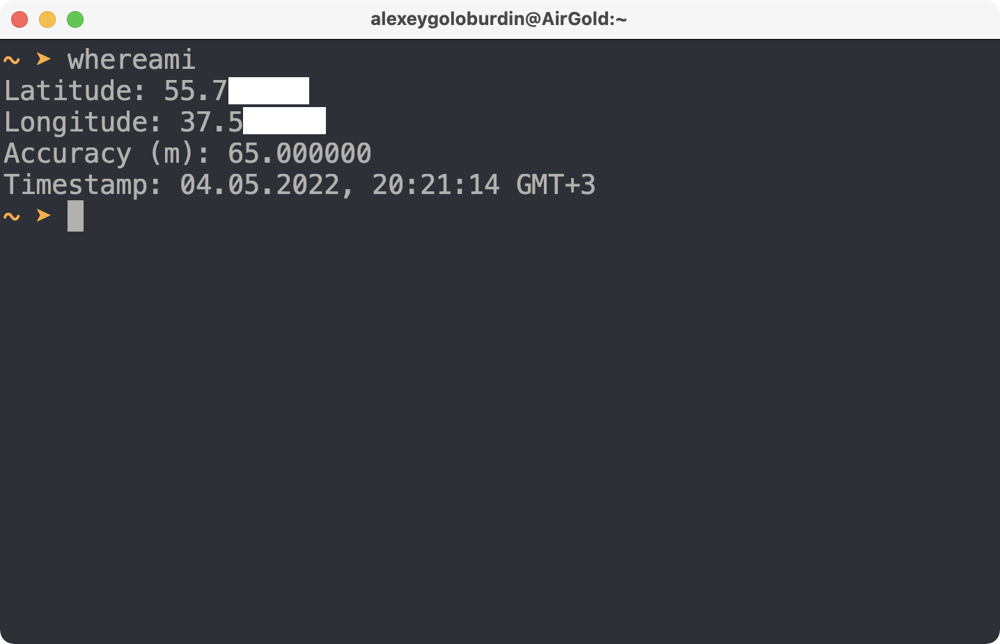

# Пишем программу погоды

Итак, давайте напишем консольную программу, которая будет показывать текущую погоду по нашим координатам. Чтоб не по IP-адресу как-то пытаться неточно вычислять местоположение, а именно по текущим реальным GPS-координатам. Чтобы программа показывала температуру за бортом, идёт ли там дождь/снег и время восхода-заката солнца. Для съёмки видео важно понимать, во сколько сегодня восход или закат солнца, чтобы ориентироваться на освещённость за окном.

Итак, в первую очередь, нам надо понять, как получить доступ к текущим координатам, есть ли такая возможность. Решение будет для MacBook, [гуглим](https://www.google.com/search?q=python+mac+get+gps+coordinates): `python mac get gps coordinates`. [Первая ссылка](https://stackoverflow.com/questions/42831672/python-get-gps-location-on-macos) говорит о программе whereami, которая печатает текущие координаты в консоль

```bash
whereami
```



Отлично, теперь мы можем получать наши текущие координаты, отправить их в какой-то сервис погоды через API, получить оттуда погоду и отобразить её.

Команда работает по аналогии с `whoami` — та показывает, «кто я», а вот команда `whereami` показывает, «где я»:).

Давайте найдём какой-то сервис погоды. Поисковый запрос `API прогноз погоды` привёл меня на проект [OpenWeather](https://home.openweathermap.org/). У них есть бесплатный доступ. Еще есть Яндекс погода в России, Gismeteo, но там, насколько я понял, для получения API-ключа надо куда-то писать на почту, для наших целей это слишком долго. Воспользуемся OpenWeather.

Запрос на получение погоды по примерно моим координатам:

```bash
http https://api.openweathermap.org/data/2.5/weather\?lat\=55.7\&lon\=37.5\&appid\=7549b3ff11a7b2f3cd25b56d21c83c6a\&lang\=ru\&units\=metric
```

`httpie` — это удобная утилита работы с веб-сервисами, такая вариация на тему `curl`, можно установить на Mac OS с помощью [brew](https://brew.sh/index_ru) командой `brew install httpie`. Она выводит в раскрашенном виде JSON, например, что удобно.

API-ключ, использующийся в запросе, получается сразу после регистрации, но активируется в течение, может быть, минут десяти.

Результат запрос:

```json
{
    "base": "stations",
    "clouds": {
        "all": 61
    },
    "cod": 200,
    "coord": {
        "lat": 55.7,
        "lon": 37.5
    },
    "dt": 1651521003,
    "id": 529334,
    "main": {
        "feels_like": 9.26,
        "grnd_level": 993,
        "humidity": 74,
        "pressure": 1013,
        "sea_level": 1013,
        "temp": 10.25, <!-- температура в градусах Цельсия -->
        "temp_max": 12.01,
        "temp_min": 8.55
    },
    "name": "Moscow", <!-- твоё место -->
    "sys": {
        "country": "RU",
        "id": 47754,
        "sunrise": 1651455877, <!-- восход в Unix time -->
        "sunset": 1651511306, <!-- закат в Unix time -->
        "type": 2
    },
    "timezone": 10800,
    "visibility": 10000,
    "weather": [
        {
            "description": "облачно с прояснениями",
            "icon": "04n",
            "id": 803, <!-- тип погоды, справочник https://openweathermap.org/weather-conditions#Weather-Condition-Codes-2 -->
            "main": "Clouds"
        }
    ],
    "wind": {
        "deg": 180,
        "gust": 8.08,
        "speed": 2.69
    }
}
```

Так, отлично, мы умеем находить текущие координаты и умеем по ним получать температуру, состояние погоды — дождь/снег/облака, а также получать время восхода и заката солнца.

Давайте напишем программу для этого! Чтобы запускаешь её и она писала наше местоположение и выводила эти данные — температуру, характеристику погоды (снег/облака/туман) и время восхода заката солнца.
