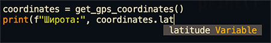
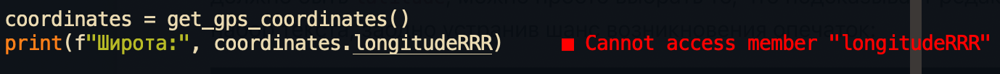

# NamedTuple — именованный кортеж

Можно воспользоваться именованным кортежем `NamedTuple`. В Python есть именованные кортежи в составе пакета `collections` и в составе `typing`. Чтобы можно было указать полям кортежа типы мы, конечно, воспользуемся импортом из `typing`:

```python
from typing import NamedTuple

class Coordinates(NamedTuple):
    latitude: float
    longitude: float

def get_gps_coordinates() -> Coordinates:
    """Returns current coordinates using MacBook GPS"""
    return Coordinates(10, 20)
```

Именованные кортежи — такие же кортежи, как и обычные `tuple`, но каждый элемент кортежа имеет имя, по которому мы можем к нему обращаться. Обращаться по имени ведь проще, чем по индексу. Индекс `0` нам мало что говорит о данных, которые лежат в этом индексе, а имя `longitude` прямо говорит нам, что тут хранится географическая долгота.

Теперь пользоваться кодом проще и разночтений никаких нет:

```python
coordinates = get_gps_coordinates()
print(f"Широта:", coordinates.latitude)  # Печать широты
print(f"Долгота:", coordinates.longitudeRRR)  # IDE подсветит ошибку опечатки
```

В редакторе кода срабатывает автокомплит (*autocomplete*), то есть автодополнение кода. Мы начинаем набирать `coordinates.lat` и редактор подсказывает нам, что здесь должно быть `latitude`, можно просто выбрать то, что подсказывает редактор и ускорить набор текста, заодно устранив шанс возникновения опечаток:



А ещё, если по какой-то причине опечатки всё же возникли, то редактор подсветит нам места с такими проблемами:




При этом такой именованный кортеж по-прежнему является кортежем, то есть им можно пользоваться и так, с распаковкой:

```python
latitude, longitude = get_gps_coordinates()
```

А также, как и в случае с обычным кортежем, нельзя изменять значения элементов кортежа:

```python
coordinates = get_gps_coordinates()
coordinates.latitude = 10  # IDE подсветит ошибку тут
```

